# 프로젝트
## 프로젝트 소개
"Week can do it!" - 교육 기업 "Week"

🌟 Welcome to Week - Your Learning Partner 🌟

"Week"는 "Week can do it!"라는 슬로건 아래, 우리의 열정과 노력이 담긴 가상 교육 기업을 소개합니다.

🏢 About Us: 회사 소개 - '윜'이란?, '윜'스토리, 사회공헌

📢 Announcements: 공지사항

📰 Press Coverage: 언론보도

❓ FAQs: 고객만족센터 - 자주하는질문

👥 Join Our Team: 인재채용 - 윜크루 되기, 윜크루 되면

📝 Contact Us: 1:1문의

🌟 Explore More - Weekly & Weekend

"Week"의 문을 열고, 함께하는 특별한 여정을 시작해보세요.  
우리는 "Week can do it!"라는 슬로건을 실천하기 위해 항상 노력하겠습니다. 

감사합니다,
"Week" 팀 드림

## 프로젝트 개요
회원의 1:1 문의글 목록, 문의글 상세보기, 문의글 등록, 문의글 수정, 문의글 삭제 등의 기능을 구현하였으며, 
관리자는 일반 회원의 관리기능인 회원 정보 수정, 회원 강제 탈퇴, 회원 통계,  
1:1문의글 관리, 공지사항, 언론보도 기능 등을 구현하였습니다. 
"Week can do it!"라는 슬로건을 가지고 "Week"이라는 가상 교육 기업을 소개하는  
첫 번째 홈페이지를 설계하였습니다! 
설계 시에는 페이퍼와 카카오 oven 프로토타입으로 사용성을 테스트 한 후,  
html, css, javascript로 작성하였습니다.  
벡엔드 부분에는 jsp의 디렉티브를 활용하여 기업의 데스크탑 웹을 작성해보았습니다. 
 
 
해당 프로젝트는 가장 기본적인 회원가입과, 로그인, 로그아웃, 오시는 길, 회원 정보, 회원 탈퇴 관련된 기능들을  
뿐만 아니라 회사소개, 공지사항, 언론보도, 자주하는질문과 1:1과 인재채용까지 메뉴바로 구현하였습니다. 
그와 관련된 메뉴들은 메뉴바를 통해 보실 수 있습니다. 
또, 홈페이지의 메인에 자회사인 "Weekly", "Weekend"로 바로 넘어갈 수 있는 버튼과  
굳이 메뉴에 들어가지 않고도 메인 홈페이지만으로 Week가 한 눈에 보일 수 있도록 CSS를 구현하였습니다. 

## 기능구현 동영상
<iframe width="560" height="315" src="https://youtu.be/sinl5TXBwlA" frameborder="0" allowfullscreen></iframe>  

## 프로젝트 설계

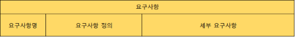
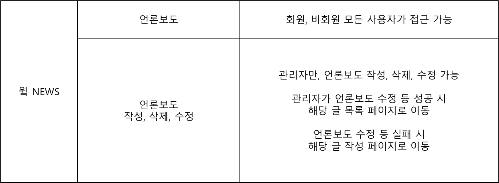
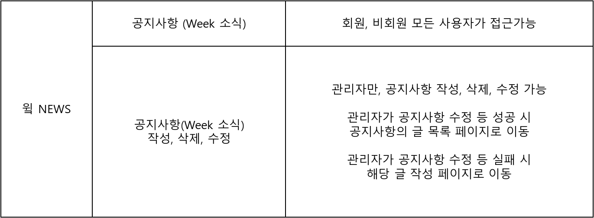
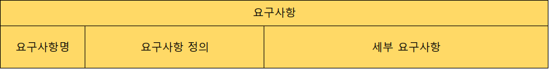
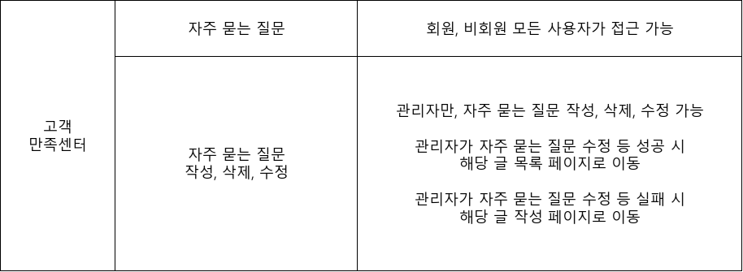
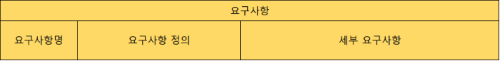
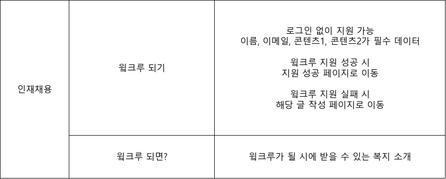
 

## 개념적 설계
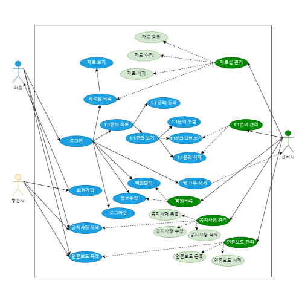
 
## 논리적 설계
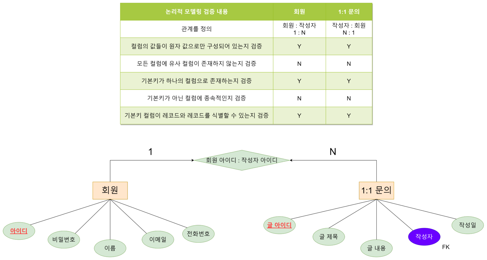
 
## 물리적 설계
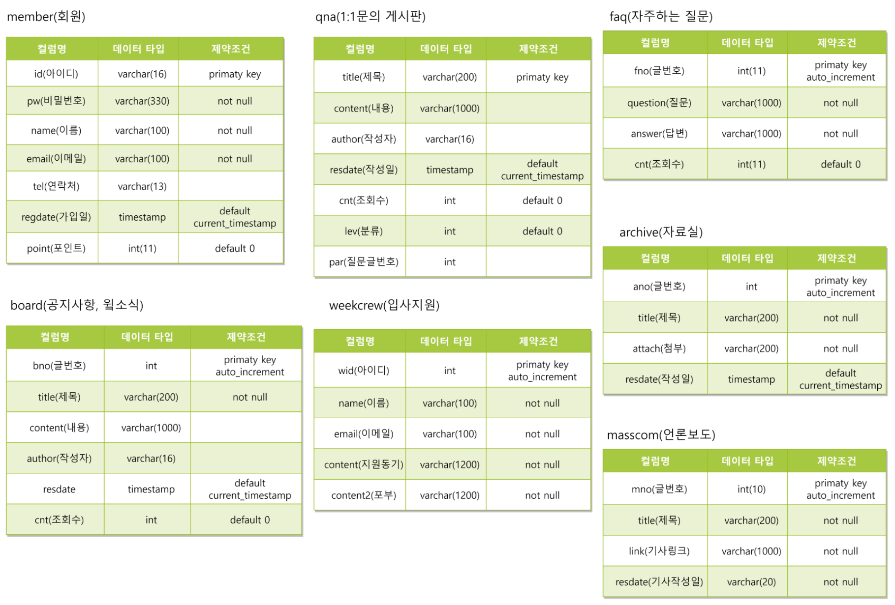
 
## 클래스 다이어그램
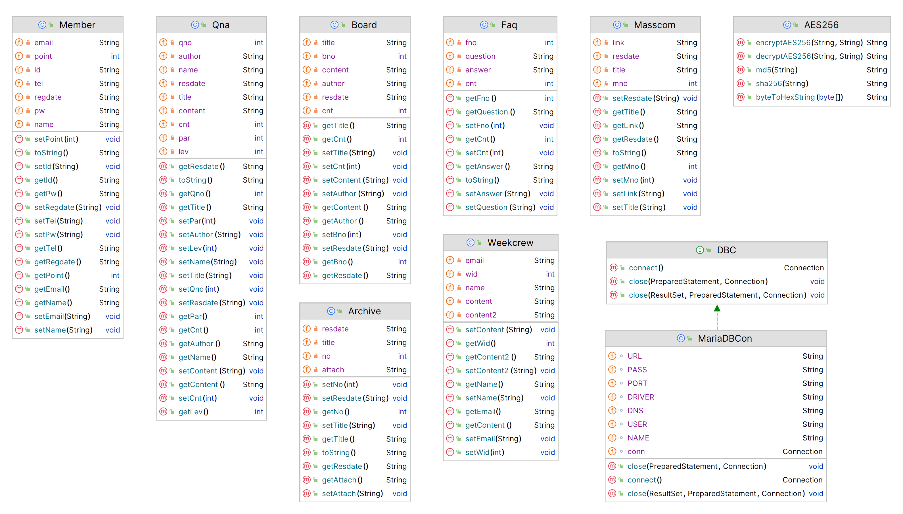
 
## Table
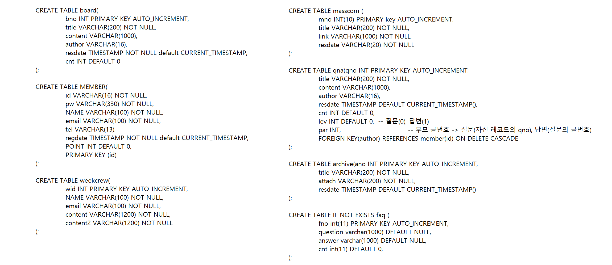
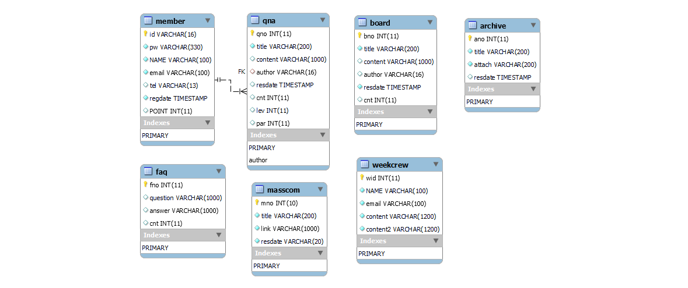
 

## 기능흐름도 (Unit Task Flow)
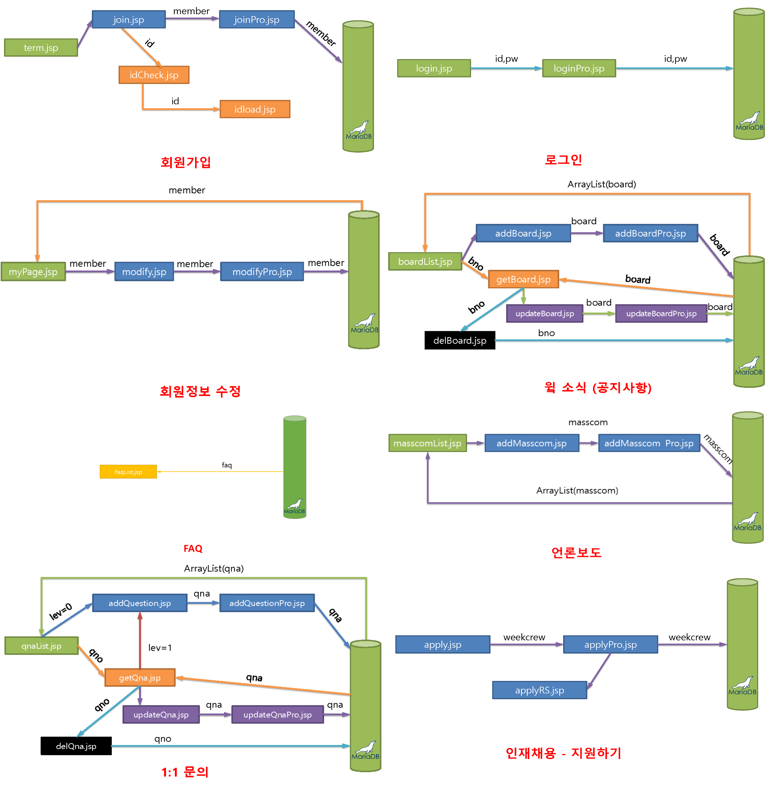
 
## OVEN HOME
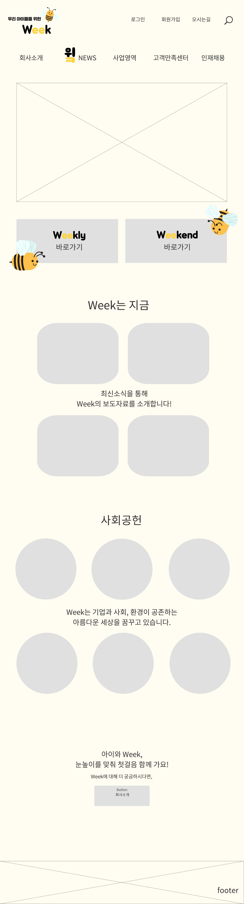
## 실제 HOME

 

## Member
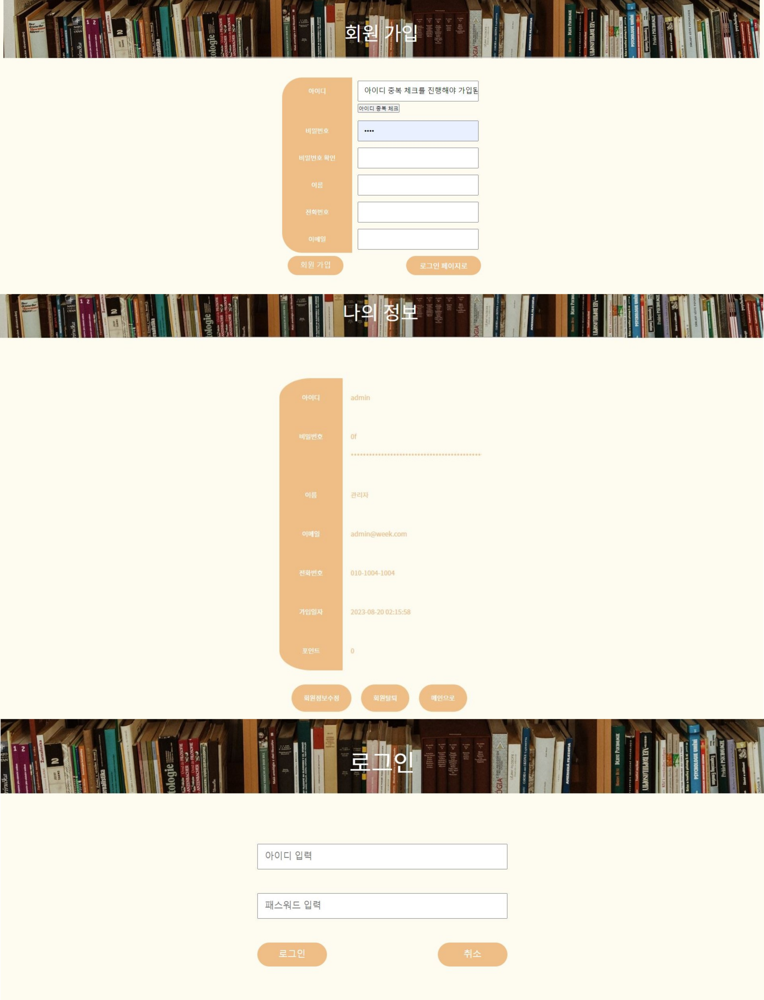
#### 회원가입
#### • 회원 약관에 동의 시 회원가입 가능
#### • 아이디 중복 체크가 완료 후에 가입 가능
#### • 비밀번호와 비밀번호 확인의 값이 일치해야 최종 회원가입 성공
#### • 비밀번호는 SHA-256 방식으로 암호화하였음
#### 로그인
#### • DB에서 비밀번호를 불러와 비교 후 로그인 성공 또는 실패
#### • 일반 회원과 달리 "admin" 관리자 계정으로 로그인 시에는 "관리자페이지" 접속 가능
#### 마이페이지
#### • 회원 정보 확인
#### • 정보 수정 시 "전화번호"와 "이메일"만 수정 가능
#### • 비밀번호는 보안 상 변경 불가
#### • 자진 회원탈퇴 기능 구현
 

## Company
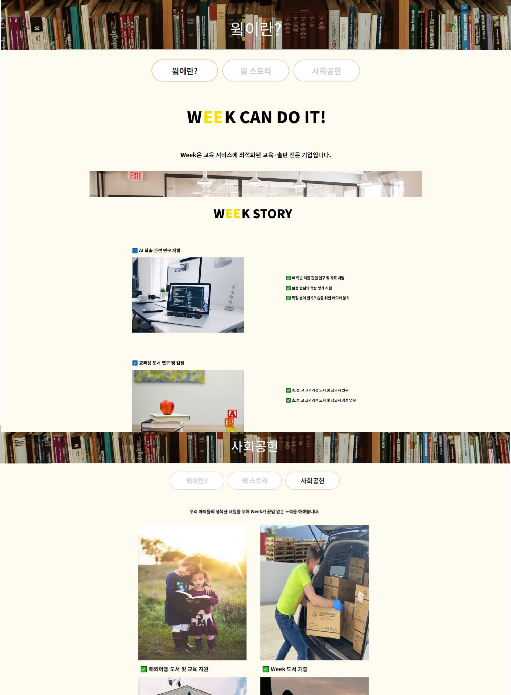
#### 회사소개
#### • 정적 콘텐츠로 WEEK에 대한 소개 페이지
#### • "윜이란" 페이지 내에서 마우스 스크롤 또는 상단 버튼 클릭을 통해 WEEK STORY로 이동 가능
 

## Board

#### 공지사항 (윜 소식)
#### • Board 테이블에서 공지사항 리스트를 불러와 출력
#### • 로그인을 하지 않아도 공지사항을 열람할 수 있음
#### • 관리자 계정으로 로그인 시에 공지사항 글 작성, 수정, 삭제가 가능함
#### • 글 수정 또는 삭제 후 공지사항 글목록으로 redirection
 

## Messcom
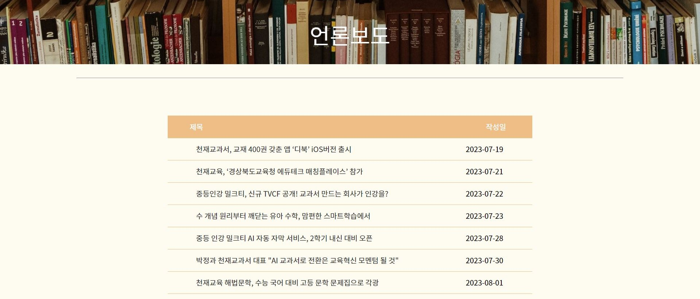
#### 언론보도
#### • 리스트의 기사제목을 클릭하면 DB에서 링크 데이터를 불러와 해당 기사페이지로 이동
#### • 관리자로 로그인 시에, 언론보도 등록 가능
 

## 고객만족센터

#### 자주하는질문
#### • Faq 테이블에서 자주 하는 질문 리스트를 불러와 출력
#### • 로그인을 하지 않아도 자주하는 질문을 열람할 수 있음
#### • 관리자 계정으로 로그인 시에 자주 하는 질문 글 작성, 수정, 삭제가 가능함
#### • 글 수정 또는 삭제 후 공지사항 글목록으로 redirection
 

## 1:1 문의

#### • Qna 테이블에서 리스트를 불러와 출력
#### • 로그인을 하지 않아도 모든 글/댓글의 열람은 가능하나 글/댓글 작성은 불가능함
#### • 모든 회원은 1:1문의 게시판에서 글/댓글 작성이 가능함
#### • 글 수정/삭제는 그 글의 작성자 또는 관리자만 가능함
#### • 댓글 삭제는 그 댓글의 작성자 또는 관리자만 가능함 (댓글 수정은 미구현)
#### • 로그인을 하지 않고 댓글창을 클릭한 경우 자동으로 로그인 화면으로 이동함
 

## 인재채용
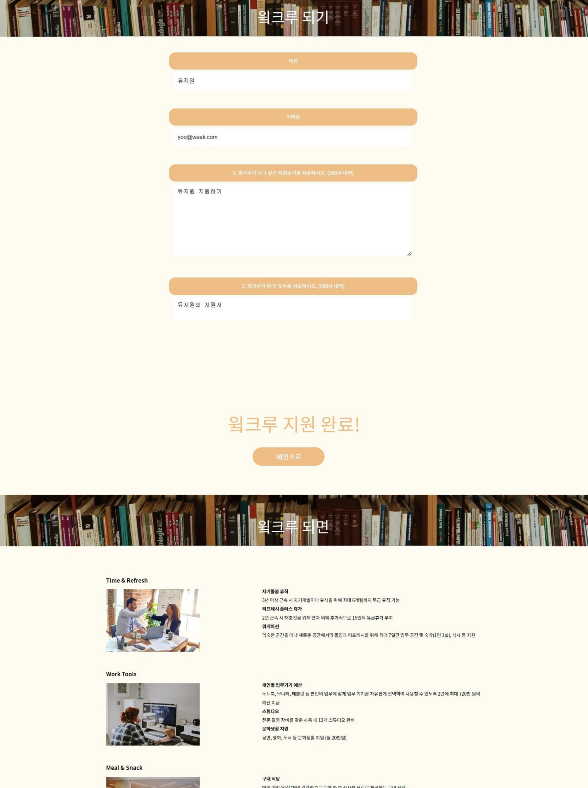
#### 윜크루 되기
#### • 이력서 지원 form으로 지원하기 버튼을 클릭 시 weekcrew 테이블에 INSERT
#### 윜크루 되면
#### • 정적 콘텐츠로 WEEK의 직원 복지 소개 페이지
 

## 관리자페이지

#### 관리자페이지
#### 회원정보 관리
#### • member 테이블에서 회원 정보를 SELECT
#### • 관리자는 원하는 회원을 강제 탈퇴 처리할 수 있음
#### 공지사항(윜 소식) 관리
#### • board 테이블에서 글 목록을 SELECT
#### • 관리자는 원하는 글을 수정 또는 삭제할 수 있음
#### • 글 수정 또는 삭제 후 공지사항 관리 페이지로 redirection 
#### 언론보도 관리
#### • masscom 테이블에서 기사 자료 SELECT
#### • 관리자는 원하는 기사를 삭제할 수 있음
#### • 삭제 후 언론보도 관리페이지로 redirection
#### 윜크루 지원서 관리
#### • weekcrew 테이블에서 지원 목록을 SELECT
#### • 관리자는 원하는 지원서를 삭제할 수 있음
#### • 지원서 삭제 후 윜크루 지원서 관리 페이지로 redirection
 

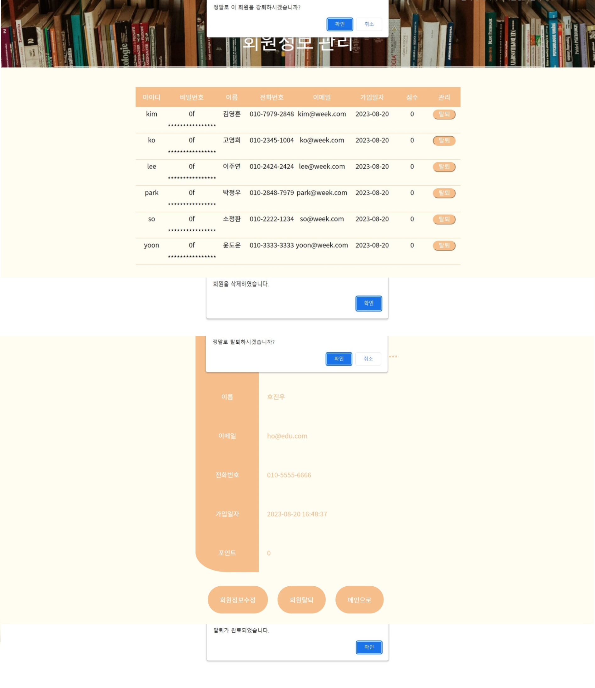
#### 탈퇴 및 강퇴
#### • 모든 회원은 마이페이지에서 회원 탈퇴 가능
#### • 관리자는 관리자페이지에서 회원 강퇴 가능
#### • 탈퇴/강퇴 버튼 클릭 시 팝업창을 띄워 재차 탈퇴/강퇴 여부를 묻고 회원 삭제를 진행

